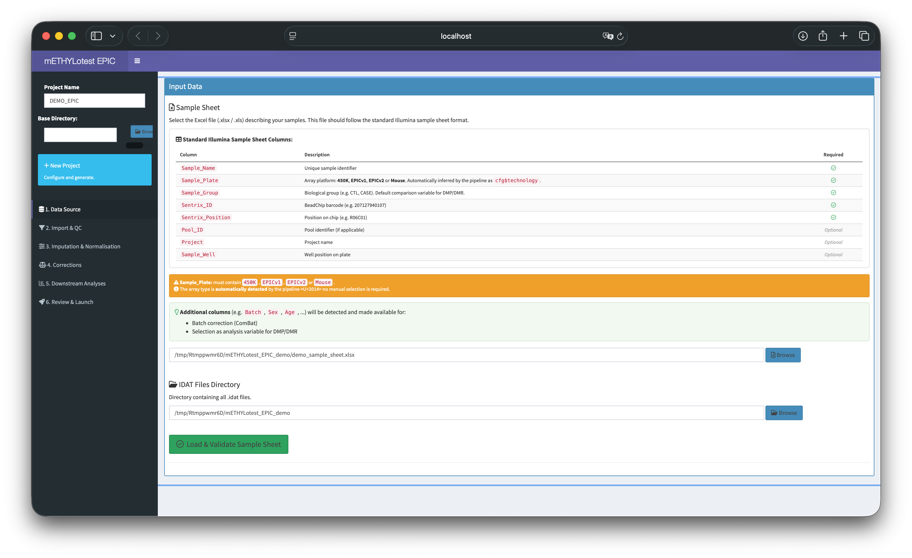
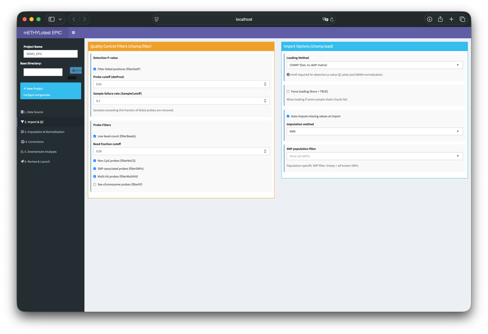
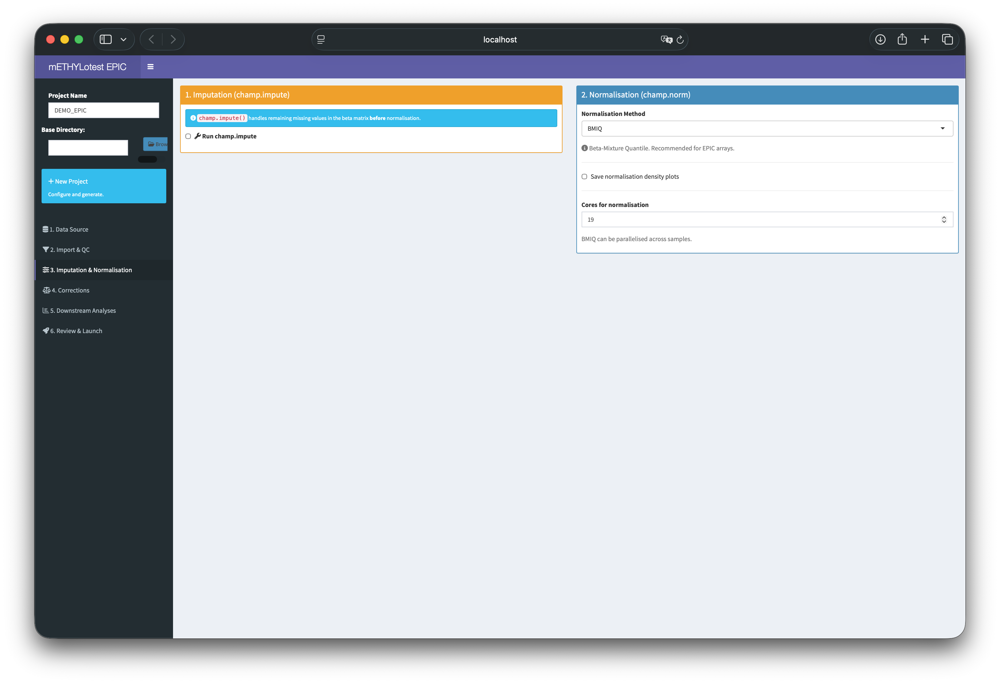
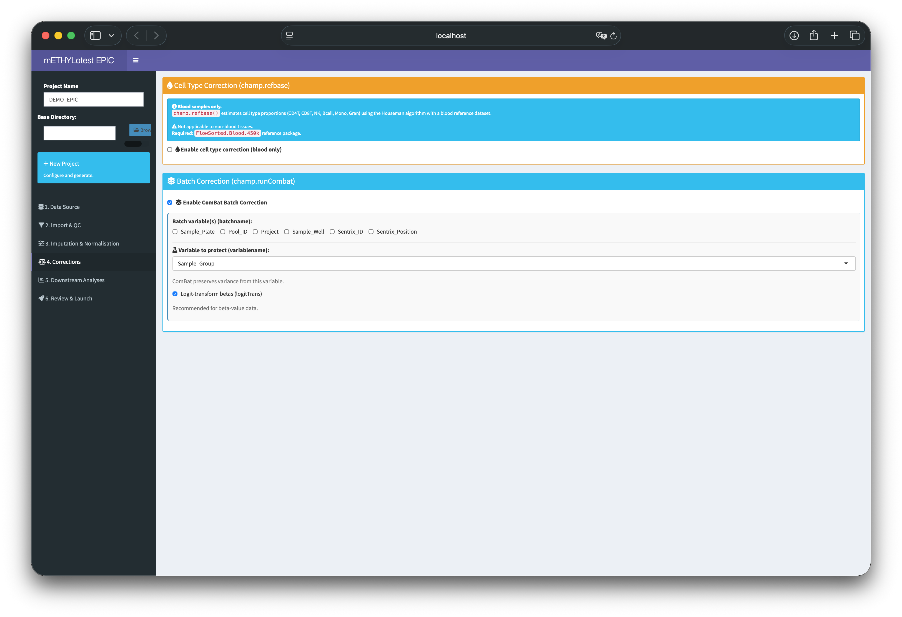
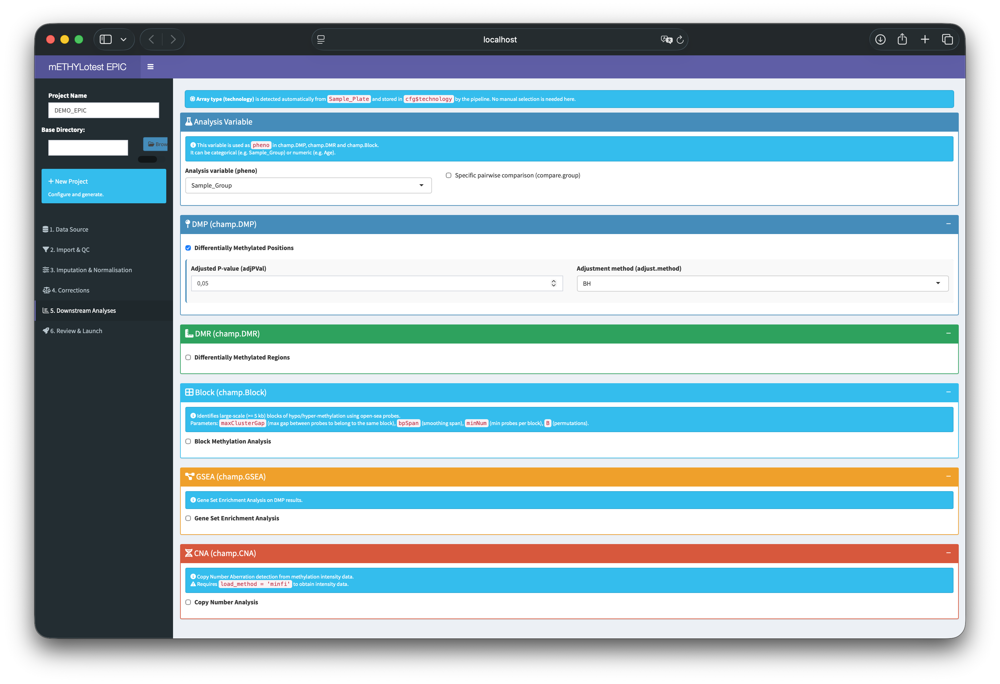
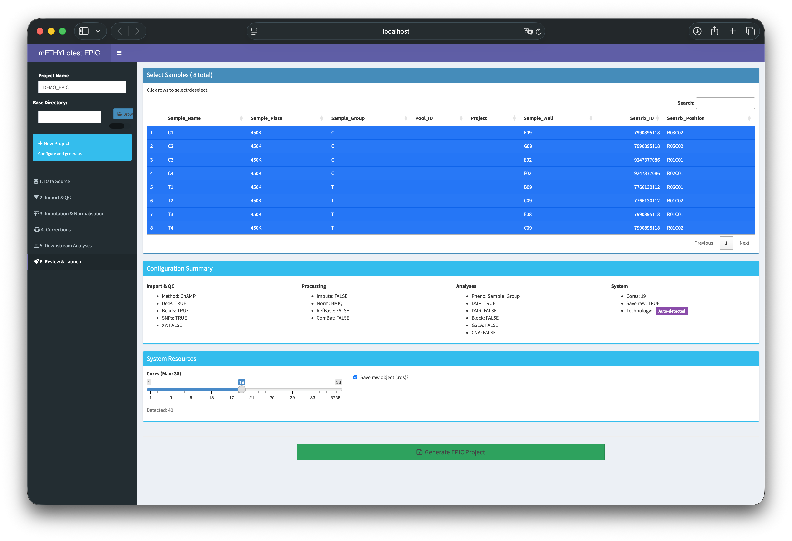

```{r setup, include=FALSE}
knitr::opts_chunk$set(
  echo    = TRUE,
  eval    = FALSE,
  message = FALSE,
  warning = FALSE
)
```

# Introduction

**mETHYLotest** is an R package providing a unified wrapper around established
DNA methylation analysis tools. This tutorial covers the **EPIC array module**,
which wraps the
[ChAMP](https://bioconductor.org/packages/ChAMP/) and
[ChAMPdata](https://bioconductor.org/packages/ChAMPdata/) packages and supports
Illumina arrays from three generations:

| Array | Technology | Approximate CpG coverage |
|---|---|---|
| 450K | Illumina Human Methylation 450 | ~450 000 CpGs |
| EPICv1 | Illumina EPIC (850K) | ~850 000 CpGs |
| EPICv2 | Illumina EPIC v2 | ~930 000 CpGs |
| Mouse | Illumina Mouse Methylation | ~285 000 CpGs |

Mixed-array cohorts (e.g. EPICv1 + EPICv2) are handled transparently through
an automated harmonization step. The array type is **detected automatically**
from the `Sample_Plate` column and stored as `cfg$technology` throughout
the pipeline.

[View example EPIC Report](https://htmlpreview.github.io/?https://github.com/OMICShub-Imagine/mETHYLotest/blob/main/inst/tutorials/EPIC_DEMO_Report.html){target="_blank"}

---

# Requirements

## R packages

```{r install}
# See the README for detailed installation instructions:
# https://github.com/OMICShub-Imagine/mETHYLotest#installation

# Core Bioconductor
if (!requireNamespace("BiocManager", quietly = TRUE))
  install.packages("BiocManager")

BiocManager::install(c(
  "ChAMP", "ChAMPdata", "minfi",
  "IlluminaHumanMethylationEPICanno.ilm10b4.hg19",
  "IlluminaHumanMethylationEPICv2anno.20a1.hg38",
  "IlluminaHumanMethylation450kanno.ilmn12.hg19",
  "FlowSorted.Blood.450k"
))

# mETHYLotest
remotes::install_github("OMICShub-Imagine/mETHYLotest")
```

## Input files

Two inputs are required:

1. **A metadata Excel file** (`.xlsx`) following the Illumina sample sheet
   format — see Section \@ref(metadata).
2. **A directory containing `.idat` files** for all samples.

---

# Metadata File Format {#metadata}

The Excel file must contain **at minimum** the following five columns.
Column names are case-sensitive and follow the standard Illumina sample
sheet convention.

## Required columns

| Column | Type | Description | Example |
|---|---|---|---|
| `Sample_Name` | character | Unique sample identifier | `CTRL_01` |
| `Sample_Plate` | character | Array platform | `450K`, `EPICv1`, `EPICv2` |
| `Sample_Group` | character | Biological group label | `CTL`, `CASE` |
| `Sentrix_ID` | character | BeadChip barcode | `207127940107` |
| `Sentrix_Position` | character | Position on chip | `R06C01` |

> **`Sample_Plate`** must contain exactly one of: `450K`, `EPICv1`,
> `EPICv2` or `Mouse`.
> The array type is inferred automatically — no manual selection needed.

> **`Sentrix_ID`** and **`Sentrix_Position`** are concatenated internally to
> locate the corresponding `.idat` files:
> `<Sentrix_ID>_<Sentrix_Position>_Red.idat` /
> `<Sentrix_ID>_<Sentrix_Position>_Grn.idat`.

## Optional standard columns

| Column | Description |
|---|---|
| `Pool_ID` | Pool identifier |
| `Project` | Project name |
| `Sample_Well` | Well position on plate |

## Additional columns

Any **extra columns** (e.g. `Batch`, `Sex`, `Age`, `Smoking_Status`) are
automatically detected and made available for:

- **Batch correction** (ComBat) — select as batch variable(s)
- **Analysis variable** — select as `pheno` for DMP/DMR/Block

Note that `Sentrix_ID` and `Sentrix_Position` are also available as batch
variables (mapped internally to `Slide` and `Array` in ChAMP).

## Example metadata

| Sample_Name | Sample_Plate | Sample_Group | Sentrix_ID | Sentrix_Position | Batch | Sex |
|---|---|---|---|---|---|---|
| CTRL_01 | EPICv1 | CTL | 207127940107 | R01C01 | B1 | F |
| CTRL_02 | EPICv2 | CTL | 207127940107 | R02C01 | B2 | M |
| CASE_01 | EPICv1 | CASE | 207127940107 | R03C01 | B1 | F |
| CASE_02 | EPICv2 | CASE | 207127940107 | R04C01 | B2 | M |

---

# Pipeline Overview

The mETHYLotest EPIC pipeline executes the following steps sequentially.
A single `beta_current` matrix flows through the entire pipeline, ensuring
each step operates on the output of the previous one.

```
champ.load()          Import IDAT files (with smart caching)
      |
  Pre-QC              Quality control (raw beta)
      |
champ.impute()        Imputation of missing values
      |
champ.norm()          Normalisation (BMIQ, PBC, SWAN...)
      |
  Post-QC             Quality control (normalised beta)
      |
champ.refbase()       Cell type correction (blood only)
      |
champ.runCombat()     Batch correction (ComBat)
      |
  Post-Combat QC      Quality control (corrected beta)
      |
beta_final            Final beta matrix for all analyses
      |
      +-- champ.DMP()       Differentially methylated positions
      |     +-- DMP Explorer UI (interactive Shiny)
      |     +-- Default signatures (top 500 CpGs)
      |     +-- User signatures (via UI)
      |     +-- Signature validation (SVM/PCA/Silhouette)
      |     +-- Validation UI (interactive Shiny)
      |     +-- HTML reports (DMP + Validation)
      |
      +-- champ.DMR()       Differentially methylated regions
      |
      +-- champ.Block()     Block methylation analysis
      |
      +-- champ.GSEA()      Gene set enrichment analysis
      |
      +-- champ.CNA()       Copy number aberration analysis
      |
      +-- Performance profiling export
```

---

# Usage

## Full Pipeline (Recommended)

```{r pipeline-full}
library(mETHYLotest)

# Opens the project setup UI, then runs the full pipeline
results <- mETHYLotest.EPIC.pipeline()

# Or re-run an existing project directly
results <- mETHYLotest.EPIC.pipeline(
  project_directory = "/path/to/My_EPIC_Project"
)
```

The function returns a named list containing all results:

```{r results-structure}
names(results)
# [1] "myLoad"        "beta_final"    "beta_history"
# [4] "pheno"         "pheno_col"     "arraytype"
# [7] "myDMP"         "myDMR"         "myBlock"
# [10] "myGSEA"       "myCNA"         "myRefBase"
# [13] "validation_results" "config"
```

## Step-by-Step

```{r pipeline-steps}
library(mETHYLotest)

# 1. Project setup UI (returns project directory path)
project_dir <- mETHYLotest.EPIC.ProjectUI()

# 2. Load and validate configuration
config_path <- file.path(project_dir, "Results", "project_config.R")
source(config_path)
mETHYLotest.EPIC.Check_ProjectSettings(config_path)
cfg <- project_config

# 3. Load results (if pipeline was already run)
results <- readRDS(file.path(project_dir, "Results", "interim",
                              "pipeline_results.rds"))

# 4. Re-open specific UIs
mETHYLotest.EPIC.DMP.UI(
  dmp_results          = results$myDMP,
  beta                 = results$beta_final,
  pheno                = results$pheno,
  arraytype            = results$arraytype,
  path_to_episignature = file.path(project_dir, "Results", "Episignatures"))

mETHYLotest.EPIC.Validate.UI(results$validation_results)
```

## Reloading an Existing Project

```{r reload}
# Via pipeline (auto-detects and locks parameters)
results <- mETHYLotest.EPIC.pipeline("/path/to/My_EPIC_Project")

# Direct RDS loading
results <- readRDS("My_EPIC_Project/Results/interim/pipeline_results.rds")
```

## Standalone Usage

Individual functions can be used on any ChAMP or beta matrix:

```{r standalone}
library(mETHYLotest)

# QC on an existing myLoad object
samples_to_remove <- mETHYLotest.EPIC.QC(
  myLoad = myLoad, outputDir = "my_qc/")

# Validate signatures on any beta matrix
val <- mETHYLotest.EPIC.validate(
  beta              = my_beta_matrix,
  pheno             = my_pheno_vector,
  signatures_folder = "my_signatures/",
  arraytype         = "EPICv1")
mETHYLotest.EPIC.Validate.UI(val)

# Check confounding before batch correction
result <- mETHYLotest.EPIC.checkConfounding(
  pd           = myLoad$pd,
  variablename = "Sample_Group",
  batchname    = c("Slide", "Array"))

# Harmonize mixed arrays
myLoad_merged <- mETHYLotest.utils.HarmonizeArrays(
  loads = list(EPICv1 = myLoad_v1, EPICv2 = myLoad_v2))
```

### Available standalone functions

| Function | Input | Output |
|---|---|---|
| `mETHYLotest.EPIC.QC()` | myLoad + beta | Flagged samples for removal |
| `mETHYLotest.EPIC.validate()` | beta + pheno + signatures | Validation results |
| `mETHYLotest.EPIC.Validate.UI()` | Validation results | Interactive Shiny benchmark |
| `mETHYLotest.EPIC.DMP.UI()` | DMP results + beta | Interactive explorer |
| `mETHYLotest.EPIC.checkConfounding()` | pd + variables | Confounding report |
| `mETHYLotest.utils.HarmonizeArrays()` | List of myLoad objects | Merged myLoad |

---

# Demo Mode

The EPIC demo uses example 450K IDAT files from the
[ChAMPdata](https://bioconductor.org/packages/ChAMPdata/) Bioconductor
package (8 samples: 4 controls, 4 cases — lung dataset).

## Quick Start

```{r epic-demo}
# Install ChAMPdata if needed
BiocManager::install("ChAMPdata")

# Launch EPIC demo
mETHYLotest.EPIC.pipeline("demo")
```

This will:

1. Locate IDAT files from the installed `ChAMPdata` package and copy them
   to a temporary directory
2. Load the demo sample sheet bundled with `mETHYLotest`
3. Open the EPIC Project Setup UI with **both paths pre-filled**
4. Display a notification asking you to click **"Load & Validate Sample Sheet"**

## Demo Dataset

| Sample_Name | Sample_Group | Sentrix_ID | Sentrix_Position | Sample_Plate |
|---|---|---|---|---|
| C1 | C | 7990895118 | R03C02 | 450K |
| C2 | C | 7990895118 | R05C02 | 450K |
| C3 | C | 9247377086 | R01C01 | 450K |
| C4 | C | 9247377086 | R02C01 | 450K |
| T1 | T | 7766130112 | R06C01 | 450K |
| T2 | T | 7766130112 | R01C02 | 450K |
| T3 | T | 7990895118 | R01C01 | 450K |
| T4 | T | 7990895118 | R01C02 | 450K |

> **Note:** This is a 450K dataset from the ChAMP documentation.
> The `Sample_Plate` column is set to `450K` automatically.

## Recommended Demo Settings

| Tab | Parameter | Value |
|---|---|---|
| Import & QC | Loading method | `ChAMP` |
| Import & QC | Filter DetP | `TRUE` |
| Import & QC | Filter SNPs | `TRUE` |
| Imputation | Run champ.impute | `FALSE` |
| Normalisation | Method | `BMIQ` |
| Corrections | Cell type (refbase) | `FALSE` |
| Corrections | Batch (ComBat) | `FALSE` |
| Downstream | DMP | `TRUE` |
| Downstream | DMR | `FALSE` (slow on demo) |
| Downstream | Block | `FALSE` |
| Downstream | GSEA | `FALSE` |
| Downstream | CNA | `FALSE` |

> **Tip:** Keep DMR, Block, GSEA and CNA disabled for a quick test.
> The demo runs in a few minutes with these settings.

## What the Demo Produces

| Output | Location | Content |
|---|---|---|
| Pre-QC plots | `Results/QC_Raw/` | Raw beta distributions, density plots |
| Post-norm QC | `Results/QC_Normalised/` | Normalised beta distributions |
| DMP results | `Results/DMP/` | CSV per comparison |
| Signatures | `Results/Episignatures/` | Top 500 CpGs (auto) + user-defined |
| Validation | `Results/Validation/` | HTML benchmark report |
| DMP Reports | `Results/DMP_Reports/` | Per-signature HTML reports |
| Pipeline results | `Results/interim/` | All R objects (.rds) |
| Performance | `Results/Pipeline_Performance.xlsx` | Per-step timing and RAM |

## Example Report

[View example EPIC Report](https://htmlpreview.github.io/?https://github.com/OMICShub-Imagine/mETHYLotest/blob/main/inst/tutorials/EPIC_DEMO_Report.html){target="_blank"}

---

# Project Setup UI {#ui}

The graphical interface guides you through project initialization across
six tabs:

```{r ui}
project_dir <- mETHYLotest.EPIC.ProjectUI()
```

## Tab 1 — Data Source

Select your metadata `.xlsx` file and IDAT directory. The file is validated
on load: missing required columns, invalid `Sample_Plate` values, and
malformed `Sentrix_Position` entries are reported immediately.

{width=100%}

## Tab 2 — Import & QC

Configure import and quality control parameters:

| Parameter | Function | Default |
|---|---|---|
| `filterDetP` | Remove probes failing detection p-value | `TRUE` |
| `detPcut` | Detection p-value threshold | `0.01` |
| `SampleCutoff` | Max fraction of failed probes per sample | `0.1` |
| `filterBeads` | Remove low bead-count probes | `TRUE` |
| `filterNoCG` | Remove non-CpG probes | `TRUE` |
| `filterSNPs` | Remove SNP-associated probes | `TRUE` |
| `filterMultiHit` | Remove multi-hit probes | `TRUE` |
| `filterXY` | Remove sex chromosome probes | `FALSE` |
| Loading method | `ChAMP` (fast) or `minfi` (provides detP matrix) | `ChAMP` |

> **Note:** `minfi` loading is required for SWAN normalisation and for
> CNA analysis (intensity data).

{width=100%}

## Tab 3 — Imputation & Normalisation

**Imputation** (`champ.impute`) runs **before** normalisation:

| Parameter | Description | Default |
|---|---|---|
| `method` | `KNN` or `Combine` | `Combine` |
| `k` | Number of neighbours (KNN) | `5` |
| `ProbeCutoff` | Max NA fraction per probe | `0.2` |
| `SampleCutoff` | Max NA fraction per sample | `0.1` |

**Normalisation** (`champ.norm`):

| Method | Description |
|---|---|
| `BMIQ` | Beta-Mixture Quantile (recommended for EPIC) |
| `PBC` | Peak-Based Correction |
| `SWAN` | Subset Within Array Normalisation (requires minfi) |
| `illumina` | Illumina internal normalisation |
| `none` | Skip normalisation |

{width=100%}

## Tab 4 — Corrections

**Cell type correction** (`champ.refbase`):
Applicable to **blood samples only**. Uses the Houseman algorithm with a
blood reference dataset. Requires `FlowSorted.Blood.450k`.

**Batch correction** (ComBat via `champ.runCombat`):
Select one or more batch variables. mETHYLotest automatically checks for
confounding before running ComBat:

- **Perfect aliasing** → variable excluded
- **Total collinearity** → variable excluded
- **Partial collinearity** → warning, ComBat proceeds
- **Singleton batches** → warning

If all variables are confounded, ComBat is skipped with a detailed warning.

{width=100%}

## Tab 5 — Downstream Analyses

| Analysis | Key Parameters | Notes |
|---|---|---|
| **DMP** | `adjPVal` = 0.05, `adjust.method` = BH | Always recommended |
| **DMR** | Bumphunter / DMRcate / ProbeLasso | Region-level analysis |
| **Block** | `maxClusterGap` = 250000, `minNum` = 5 | Large-scale blocks |
| **GSEA** | `method` = fisher, `adjPval` = 0.05 | Requires DMP results |
| **CNA** | `controlGroup`, `freqThreshold` = 0.3 | Requires minfi loading |

> **Array type** is detected automatically and applied to all functions.

{width=100%}

## Tab 6 — Review & Launch

Select/deselect samples, review configuration summary, set system
resources, and generate the project.

{width=100%}

---

# Pipeline Details

## Smart Loading

The pipeline checks for an existing `myLoad.rds` before importing.
If found, IDAT import is skipped entirely:

```{r smart-load}
# First run: imports from IDAT files (slow, especially with minfi)
# Second run: loads from Results/interim/myLoad.rds (instant)
```

This makes re-running the pipeline after parameter changes very fast.

## Data Loading

IDAT files are loaded per array type using `ChAMP::champ.load()`. A
temporary `Pheno.csv` is written with ChAMP-compatible column names:

| Metadata column | ChAMP column |
|---|---|
| `Sample_Name` | `Sample_Name` |
| `Sentrix_ID` | `Slide` |
| `Sentrix_Position` | `Array` |
| `Sample_Group` | `Sample_Group` |

## Mixed-Array Harmonization

When samples span multiple array generations, mETHYLotest harmonizes them
automatically:

```{r harmonize}
myLoad_merged <- mETHYLotest.utils.HarmonizeArrays(
  loads = list(EPICv1 = myLoad_v1, EPICv2 = myLoad_v2),
  duplicate_strategy = "mean"
)
```

EPICv2 replicate probe suffixes (e.g. `_BC21`) are stripped. Duplicates
are collapsed by **mean** (default) or **first**. Only probes present in
**all** arrays are retained.

## Beta Matrix Flow

A single `beta_current` matrix traverses the entire pipeline:

```
beta_current = raw betas
  → champ.impute  → "imputed"
  → champ.norm    → "imputed + normalised (BMIQ)"
  → champ.refbase → "... + refbase"
  → champ.runCombat → "... + ComBat(Slide)"
  = beta_final
```

The full transformation history is tracked in `results$beta_history`.

## Quality Control

QC is performed at **three checkpoints**:

1. **Pre-normalisation** — on raw beta values
2. **Post-normalisation** — on normalised beta values
3. **Post-ComBat** — on batch-corrected beta values

At each checkpoint, flagged samples are removed from all data structures.

## Cell Type Correction

`champ.refbase()` can fail if beta values are exactly 0 or 1.
mETHYLotest handles this by:

1. Clamping to `[0.001, 0.999]`
2. Removing NA and near-zero variance probes
3. Attempting correction; retrying with `[0.01, 0.99]` if it fails
4. Continuing without correction if all attempts fail

## Batch Correction

ComBat is applied sequentially for each unconfounded batch variable.
The confounding check returns structured results:

```{r confounding}
result <- mETHYLotest.EPIC.checkConfounding(
  pd           = myLoad$pd,
  variablename = "Sample_Group",
  batchname    = c("Slide", "Array"))
result$confounded  # Variables excluded
result$clean       # Variables safe for ComBat
```

## DMP Analysis, Signatures and Validation

After `champ.DMP()`, mETHYLotest automatically:

1. **Generates default signatures** — top 500 CpGs per comparison,
   ranked by combined score:
   $$\text{score} = -\log_{10}(\text{adj.P.Val}) \times |\Delta\beta|$$
   Filters: `adj.P.Val < 0.05`, `|deltaBeta| >= 0.1`, capped at 500.

2. **Opens the DMP Explorer UI**:
   - Volcano plot with adjustable thresholds
   - Delta beta density plot
   - Interactive chromosomal map (chromoMap)
   - Distribution barplots (CGI, genomic feature, chromosome)
   - Genomic window viewer with loess smoothing
   - Interactive heatmap (heatmaply)
   - Signature export to `.txt` files

3. **Validates all signatures** (default + user) via SVM/PCA/Silhouette

4. **Opens the Validation UI**:
   - Value boxes (AUC, Sensitivity, Silhouette)
   - Benchmark table comparing all signatures
   - PCA with confidence ellipses
   - Heatmap clustering
   - Confusion matrix and ROC curve
   - Top 20 discriminative CpGs with gene mapping

5. **Generates HTML reports** — per-signature DMP reports + global
   validation benchmark report

---

# Reports

## QC report

Generated at the end of the QC.

[View example EPIC QC Report](https://htmlpreview.github.io/?https://github.com/OMICShub-Imagine/mETHYLotest/blob/main/inst/tutorials/EPIC_DEMO_QC_report.html){target="_blank"}

## EPIC Report

Generated at the end of the pipeline with a comprehensive summary of
all analyses performed.

[View example EPIC Report](https://htmlpreview.github.io/?https://github.com/OMICShub-Imagine/mETHYLotest/blob/main/inst/tutorials/EPIC_DEMO_Report.html){target="_blank"}

## Validation Report

Generated after signature validation with per-signature benchmarks.

[View example EPIC Validation Report](https://htmlpreview.github.io/?https://github.com/OMICShub-Imagine/mETHYLotest/blob/main/inst/tutorials/EPIC_DEMO_Validation_Report.html){target="_blank"}

---

# Project Structure

```
My_EPIC_Project/
├── data/
│   └── selected_samples.xlsx
│
└── Results/
    ├── project_config.R
    ├── Pipeline_Performance.xlsx
    ├── interim/
    │   ├── myLoad.rds
    │   ├── myNorm.rds
    │   ├── myDMP.rds
    │   ├── validation_results.rds
    │   └── pipeline_results.rds
    │
    ├── QC_Raw/
    ├── QC_Normalised/
    ├── QC_Combat/
    ├── CellType/
    ├── DMP/
    ├── Episignatures/
    ├── DMP_Reports/
    ├── Validation/
    ├── DMR/
    ├── Block/
    ├── GSEA/
    └── CNA/
```

---

# Configuration Reference

```{r config-ref}
# Paths
cfg$project_dir; cfg$res_dir; cfg$rds_dir
cfg$pheno_file; cfg$idat_dir
cfg$technology      # Auto-detected: "450K", "EPICv1", "EPICv2"

# QC Filters
cfg$filter_det_p    # TRUE
cfg$det_p_cut       # 0.01
cfg$filter_beads    # TRUE
cfg$filter_snps     # TRUE
cfg$filter_xy       # FALSE

# Processing
cfg$do_impute       # TRUE/FALSE
cfg$norm_method     # "BMIQ"
cfg$do_refbase      # TRUE/FALSE (blood only)
cfg$perform_batch_correction  # TRUE/FALSE
cfg$batch_cols      # c("Sentrix_ID")

# Analysis
cfg$analysis_pheno  # "Sample_Group"
cfg$compare_group   # NULL or c("CTL", "CASE")
cfg$do_dmp          # TRUE
cfg$do_dmr          # FALSE
cfg$do_block        # FALSE
cfg$do_gsea         # FALSE
cfg$do_cna          # FALSE

# System
cfg$num_cores       # 4
cfg$save_raw_obj    # TRUE
```

---

# Supported Array Types

| `Sample_Plate` value | ChAMP arraytype | Annotation package |
|---|---|---|
| `450K` | `450K` | `IlluminaHumanMethylation450kanno.ilmn12.hg19` |
| `EPICv1` | `EPICv1` | `IlluminaHumanMethylationEPICanno.ilm10b4.hg19` |
| `EPICv2` | `EPICv2` | `IlluminaHumanMethylationEPICv2anno.20a1.hg38` |
| `Mouse` | `mouse` | Mouse-specific annotation |

---

# Troubleshooting

| Error | Cause | Solution |
|---|---|---|
| `matrix D is not positive definite` | Beta values at 0/1 in refbase | Handled automatically |
| `SWAN requires minfi` | Wrong loading method | Switch to `minfi` |
| `reduce can only handle matrices` | DMR annotation mismatch | Check beta is numeric matrix |
| All batch variables confounded | Experimental design issue | Skip ComBat or redesign |
| GSEA `strsplit` error | Empty gene columns in DMP | Check annotation packages |
| CNA requires intensity | Wrong loading method | Switch to `minfi` |
| Connection refused (Shiny) | Remote server | App uses `host = "0.0.0.0"` |

### Performance Tips

- Use `ChAMP` loading unless you need `detP` or CNA
- BMIQ can be parallelised: increase `norm_cores`
- Default signatures are capped at 500 CpGs for fast validation
- Disable DMR/Block/GSEA/CNA for quick exploratory runs

---

# Episignature Scoring (Experimental) {#episignatures}

> **Status: Experimental.** Results should be interpreted with caution.

## What it does

Compares your samples against an **internal control cohort** shipped with
mETHYLotest. For each known episignature (e.g. Sotos, Kabuki...):

1. Merges and harmonizes your data with internal controls
2. Converts to M-values
3. Computes per-probe Z-scores against the control distribution
4. Reports a **Global Score** per signature per sample

## Usage

```{r episig}
# After the main pipeline
scores <- mETHYLotest.EPIC.Episignatures("/path/to/My_Project")

# Or standalone
project_dir <- mETHYLotest.EPIC.ProjectUI()
scores <- mETHYLotest.EPIC.Episignatures(project_dir)
```

## Output

```
Results/Episignatures_Scoring/
├── episignature_scores.csv
├── episignature_scores.rds
└── Episignature_Report.html
```

## Interpreting scores

| Metric | Meaning |
|---|---|
| **Global Score** | Significant / Total × 100. Most robust. |
| **% Significant** | Significant / Found × 100. Relative to available probes. |
| **Coverage %** | Found / Total × 100. Testable fraction. |

A **Global Score > 20–30%** warrants further investigation.
Scores below 5% are generally background noise.

> **Caveats:** Small internal control cohort, literature-based signatures,
> screening tool only. Positive results require molecular confirmation.

---

# Citation

```{r citation, eval=TRUE}
citation("mETHYLotest")
```

---

# Session Info

```{r session, eval=TRUE, echo=FALSE}
sessionInfo()
```
